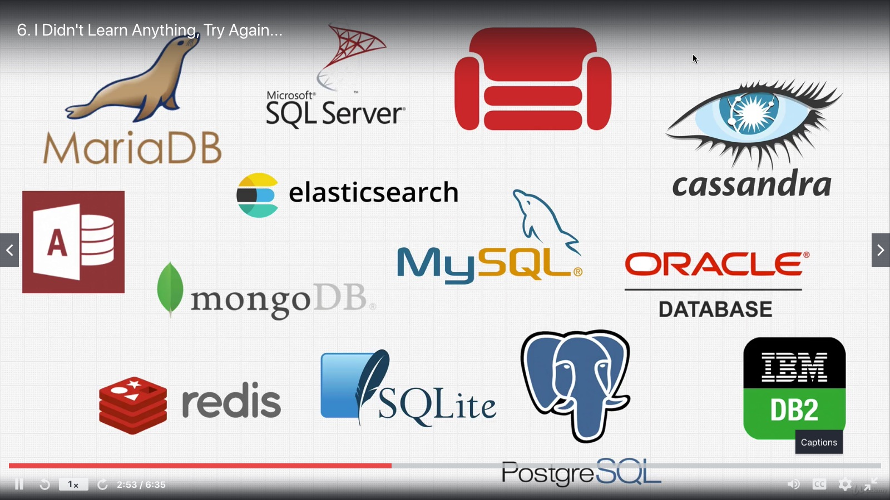
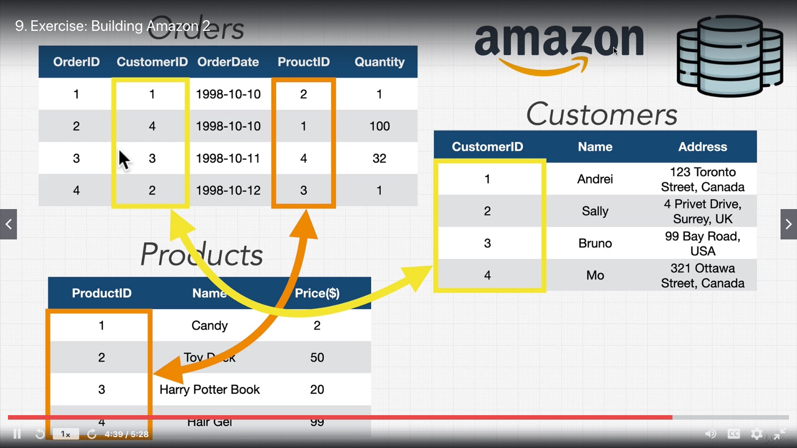
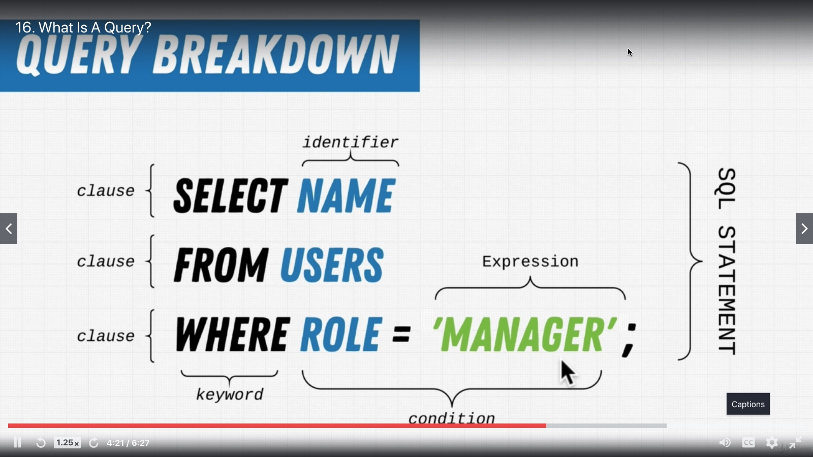
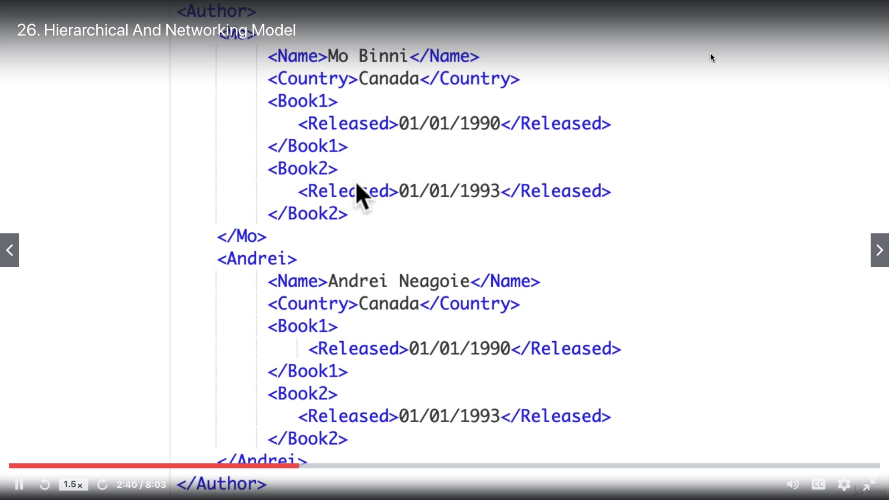
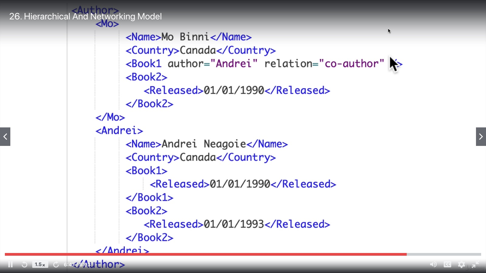
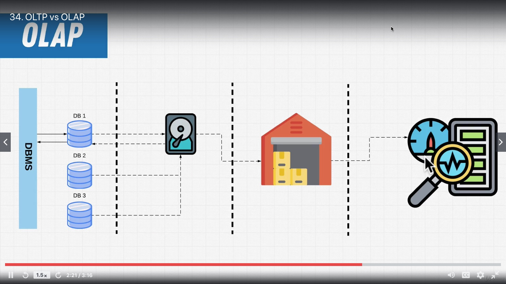

# Complete SQL + Databases Bootcamp: Zero to Mastery [2020]

## Table of Contents

- [Complete SQL + Databases Bootcamp: Zero to Mastery [2020]](#complete-sql--databases-bootcamp-zero-to-mastery-2020)
  - [Table of Contents](#table-of-contents)
    - [Section 1: Introduction](#section-1-introduction)
    - [Section 2: History And Story Of Data](#section-2-history-and-story-of-data)
    - [Section 3: Databases + SQL Fundamentals](#section-3-databases--sql-fundamentals)
    - [Section 4: Environment Setup](#section-4-environment-setup)
    - [Section 5: SQL Deep Dive](#section-5-sql-deep-dive)
    - [Section 6: Advanced SQL](#section-6-advanced-sql)
    - [Section 7: Database Management](#section-7-database-management)
    - [Section 8: Solving The Mystery](#section-8-solving-the-mystery)
    - [Section 9: Database Design](#section-9-database-design)
    - [Section 10: Database Landscape, Performance and Security](#section-10-database-landscape-performance-and-security)
    - [Section 11: Where To Go From Here?](#section-11-where-to-go-from-here)
    - [Section 12: Exrtas: Data Engineering (And the role of Machine Learning)](#section-12-exrtas-data-engineering-and-the-role-of-machine-learning)
    - [Section 13: Extras: Redis](#section-13-extras-redis)
    - [Section 14: Extra Bits: Databases In A Web App (with Node.js)](#section-14-extra-bits-databases-in-a-web-app-with-nodejs)
    - [Section 15: BONUS SECTION](#section-15-bonus-section)

### Section 1: Introduction

- [Live SQL Zoo Study Guide](https://github.com/chesterheng/sql-zoo)

**[⬆ back to top](#table-of-contents)**

### Section 2: History And Story Of Data

#### 5. What Is a Database?

It's a collection of data, a method for accessing and manipulating that data.

Data are collected by many sources

- Drone
- Mobile App
- Web App
- Videocam
- Automobile

**[⬆ back to top](#table-of-contents)**

#### 6. I Didn't Learn Anything, Try Again...

[Why is a database always represented with a cylinder?](https://stackoverflow.com/questions/2822650/why-is-a-database-always-represented-with-a-cylinder)



Data are collected and use by different people

- Product Managers: learn from data to improve the product
- Marketers: analyse business decision
- Web Developers
- Data Analysts: analyse and build machine learning model
- Data Engineer
- Data Administrator

**[⬆ back to top](#table-of-contents)**

#### 7. Database Management System (DBMS)

- How to put data in DB
- How to use/update/learn from data
- How to remove data

Confusing Acronyms

- DBMS: Database Management System
- RDBMS: Relational Database Management System
- SQL: Structured Query Language

Confusing Anagrams


**[⬆ back to top](#table-of-contents)**

#### 8. Exercise: Building Amazon

[SQL Playground](https://www.w3schools.com/sql/trysql.asp?filename=trysql_asc)

**[⬆ back to top](#table-of-contents)**

#### 9. Exercise: Building Amazon 2



**[⬆ back to top](#table-of-contents)**

#### 10. 5 Types Of Databases

5 data models

- Relational: support asset transactions
- Document: data is in a document, scalability
- Key Value: simple way to access data
- Graph: good for connected data
- Wide Columnar

**[⬆ back to top](#table-of-contents)**

#### 11. Exercise: What Is A Database?

- A database is a hardware and software system that allows a user to store, organize and use data.
- A database is a hardware and software system stores data and answer questions. 

**[⬆ back to top](#table-of-contents)**

#### 12. Section Review

- Do you have useful data?
- Install a DB to Store Data
- Use SQL to Setup + Use Data

**[⬆ back to top](#table-of-contents)**

### Section 3: Databases + SQL Fundamentals

#### 13.  SQL Playground

[DB Fiddle - SQL Database Playground](https://www.db-fiddle.com/)

**[⬆ back to top](#table-of-contents)**

#### 14. Exercise: Setting Up Your First Database

```sql
CREATE TABLE Class (
  id character(255),
  year integer NOT NULL,
  PRIMARY KEY(id)
);

CREATE TABLE Student (
  id varchar(255) NOT NULL,
  class varchar(255) NOT NULL,
  firstName varchar(255) NOT NULL,
  lastName varchar(255) NOT NULL,
  dob date NOT NULL,
  sex varchar(1) NOT NULL,
  FOREIGN KEY (class) REFERENCES Class(id),
  PRIMARY KEY (id)
);

INSERT INTO Class(id, year) VALUES('c1', 1);
INSERT INTO Class(id, year) VALUES('c2', 2);
INSERT INTO Class(id, year) VALUES('c2a', 2);

INSERT INTO Student VALUES ('s1', 'c1', 'George', 'Jacobson', '1992-01-01', 'm');
INSERT INTO Student VALUES ('s2', 'c2', 'Macy', 'Waterson', '1992-01-01', 'f');
INSERT INTO Student VALUES ('s3', 'c1', 'Bill', 'Peters', '1992-01-01', 'm');
INSERT INTO Student VALUES ('s4', 'c1', 'Janine', 'Wilson', '1992-01-01', 'f');
INSERT INTO Student VALUES ('s5', 'c2', 'Jason', 'Lipton', '1992-01-01', 'm');
```

**[⬆ back to top](#table-of-contents)**

#### 15. What Is SQL?

- SQL is programming language to talk to database
- Database is a structured set of data

**[⬆ back to top](#table-of-contents)**

#### 16. What Is A Query?

- Query is question written in SQL statement



```sql
CREATE TABLE User (
  id varchar(255) NOT NULL,
  name varchar(255) NOT NULL,
  lastName varchar(255) NOT NULL,
  dob date NOT NULL,
  sex varchar(1) NOT NULL,
  role varchar(255) NOT NULL,
  PRIMARY KEY (id)
);

INSERT INTO User VALUES ('u1', 'George', 'Jacobson', '1992-01-01', 'm', 'manager');
INSERT INTO User VALUES ('u2', 'Macy', 'Waterson', '1992-01-01', 'f', 'employee');
INSERT INTO User VALUES ('u3', 'Bill', 'Peters', '1992-01-01', 'm', 'employee');
INSERT INTO User VALUES ('u4','Janine', 'Wilson', '1992-01-01', 'f', 'manager');
INSERT INTO User VALUES ('u5', 'Jason', 'Lipton', '1992-01-01', 'm', 'manager');

SELECT * 
FROM User
WHERE role = 'employee';
```

**[⬆ back to top](#table-of-contents)**

#### 17. Imperative vs Declarative

- Declarative: What will happen?
- Imperative: How it will happen?

**[⬆ back to top](#table-of-contents)**

#### 18. History of SQL

- [Edgar F. Codd](https://www.ibm.com/ibm/history/exhibits/builders/builders_codd.html)
- [Donald Chamberlin](https://researcher.watson.ibm.com/researcher/view.php?person=us-dchamber)
- [The Story of two Genius Scientists Behind SQL](http://www.yourtechstory.com/2019/08/27/story-two-genius-scientists-sql/)
- [A Relational Model of Data for Large Shared Data Banks](section-03/codd.pdf)
- [SEQUEL: A STRUCIURED ENGLISH QUERY LANGUAGE](section-03/sequel-1974.pdf)

**[⬆ back to top](#table-of-contents)**

#### 19. Exercises: The Select Statement

[Exercises: The Select Statement](https://www.w3schools.com/sql/exercise.asp?filename=exercise_select1)

```sql
-- Insert the missing statement to get all the columns from the Customers table.
SELECT * 
FROM Customers;

-- Write a statement that will select the City column from the Customers table.
SELECT City
FROM Customers;

-- Select all the different values from the Country column in the Customers table.
SELECT DISTINCT Country 
FROM Customers;
```

**[⬆ back to top](#table-of-contents)**

#### 20. Optional: History of SQL Deep Dive

[History of Databases](https://www.youtube.com/watch?v=KG-mqHoXOXY)

**[⬆ back to top](#table-of-contents)**

#### 21. SQL Standards

[The SQL Standard – ISO/IEC 9075:2016 (ANSI X3.135)](https://blog.ansi.org/2018/10/sql-standard-iso-iec-9075-2016-ansi-x3-135/#gref)


**[⬆ back to top](#table-of-contents)**

#### 22. What Is A Database? Revisited


File processing systems

- save data on individual files
- no correlation between the files
- no relationship between the data
- update in one file is not reflected in data of relationed files
- no common standards per system
- no common models per data
- data are isolated and duplicated across systems

Model: structure of data


**[⬆ back to top](#table-of-contents)**

#### 23. Database Oriented Approach


**[⬆ back to top](#table-of-contents)**

#### 24. Exercise: SQL Starter Quiz

[SQL Starter Quiz](https://www.jetpunk.com/user-quizzes/1336712/sql-starter-quiz)

**[⬆ back to top](#table-of-contents)**

#### 25. Database Models

How you organize and store your data ?

- Hierarchical
- Networking
- Entity-Relationship
- Relational
- Object Oriented
- Flat
- Semi-Structured

**[⬆ back to top](#table-of-contents)**

#### 26. Hierarchical And Networking Model

Hierarchical Model


- each child can have only one parent
- child is tightly couple with parent
- represent 1 to many relationship



Networking Model


- represent many to many relationship



**[⬆ back to top](#table-of-contents)**

#### 27. Relational Model


**[⬆ back to top](#table-of-contents)**

#### 28. DBMS Revisited

DBMS features

- App <-> SQL <-> DBMS
- CRUD operations
- Manage your data
- Secure your data
- Transactional management


[Codd's Rules for RDBMS](https://www.w3resource.com/sql/sql-basic/codd-12-rule-relation.php)

**[⬆ back to top](#table-of-contents)**

#### 29. Relational Model Revisited


**[⬆ back to top](#table-of-contents)**

#### 30. Tables


**[⬆ back to top](#table-of-contents)**

#### 31. Columns


**[⬆ back to top](#table-of-contents)**

#### 32. Rows


**[⬆ back to top](#table-of-contents)**

#### 33. Primary And Foreign Keys


**[⬆ back to top](#table-of-contents)**

#### 34. OLTP vs OLAP

- OLTP: Support day to day


- OLAP: Support analysis



**[⬆ back to top](#table-of-contents)**

#### 35. Exercise: OLTP vs OLAP

- A database is being used to log orders and customers: OLTP
- A database is being used to figure out what new products we should offer: OLAP
- A database is being used to derive statistics for reporting to the executives: OLAP
- A database is being used to keep track of logged in users: OLTP

**[⬆ back to top](#table-of-contents)**

#### 36. Exercise: Relational Model Quiz

[Exercise: Relational Model Quiz](https://www.jetpunk.com/user-quizzes/1336712/the-relational-model)

**[⬆ back to top](#table-of-contents)**

### Section 4: Environment Setup

#### 38. Why PostgreSQL

- [PostgreSQL](https://www.postgresql.org/)
- [Studio for PostgreSQL](https://valentina-db.com/en/studio-for-postgresql)
- [Valentina Studio](https://www.valentina-db.com/en/all-downloads/vstudio)

[PostgreSQL is the worlds’ best database](https://www.2ndquadrant.com/en/blog/postgresql-is-the-worlds-best-database/)

**[⬆ back to top](#table-of-contents)**

#### 39. Environment Tooling


**[⬆ back to top](#table-of-contents)**

#### 40. SQL Tooling Alternatives

our choice was based on multiple criteria

- Is it cross-platform?
- Is it easy to use?
- Is it free?
- Can it be extended to multiple database providers?

Alternatives

- [PG Admin + Command line](https://www.pgadmin.org/)
- [Datagrip](https://www.jetbrains.com/datagrip/)
- [DBeaver](https://dbeaver.io/)
- [Falcon](https://github.com/plotly/falcon)
- [DbVisualizer](https://www.dbvis.com/)
- [TablePlus](https://tableplus.com/)

**[⬆ back to top](#table-of-contents)**

#### 41. Command Line 101

[Command Line 101](https://medium.com/@aechagen/mac-terminal-101-13a3e8e75d4c)

**[⬆ back to top](#table-of-contents)**

#### 45. MAC Setup

- [Removing existing PostgreSQL Installations](https://postgresapp.com/documentation/remove.html)
- [Installing Postgres.app](https://postgresapp.com/)
- [Dockerize PostgreSQL](https://docs.docker.com/engine/examples/postgresql_service/)


**[⬆ back to top](#table-of-contents)**

#### 46. MAC Commandline tools

[CLI Tools](https://postgresapp.com/documentation/cli-tools.html)

**[⬆ back to top](#table-of-contents)**

#### 49. Importing Data On MAC

```console
psql -U chesterheng -d Employees < employees.sql
psql -U chesterheng -d World < world.sql
psql -U chesterheng -d Store < store.sql
psql -U chesterheng -d France < france.sql
```

**[⬆ back to top](#table-of-contents)**

### Section 5: SQL Deep Dive

#### 52. Starting With Query


- DCL: Data control language
- DDL: Data definition language
- DQL: Data query language
- DML: Data modification language

What is a select? Retrieve data

**[⬆ back to top](#table-of-contents)**

#### 53. Exercise: Simple Queries

```sql
SELECT * FROM "public"."employees";
SELECT * FROM "public"."departments";
```

**[⬆ back to top](#table-of-contents)**

#### 54. Exercise: Renaming Columns

```sql
SELECT emp_no AS "Employee #",
  birth_date AS "Birthday",
  first_name AS "First Name"
FROM "public"."employees";
```

**[⬆ back to top](#table-of-contents)**

#### 55. Concat Function

- Make your data prettier/simpler

```sql
SELECT emp_no,
  CONCAT(first_name, ' ', last_name) AS "full name"
FROM "public"."employees";
```

**[⬆ back to top](#table-of-contents)**

#### 56. What Is A Function In SQL?

- input -> function -> output
- a function is a set of steps that creates a single value

Types of functions

- Aggregate: operate on many records to produce 1 value
- Aggregate: produce a summary
- Scalar: operate on each record independently

**[⬆ back to top](#table-of-contents)**

#### 57. Aggregate Functions

[Aggregate Functions](https://www.postgresql.org/docs/12/functions-aggregate.html)

- AVG()
- COUNT
- MIN()
- MAX()
- SUM()

```sql
SELECT COUNT(emp_no) FROM "public"."employees";
SELECT MAX(salary) FROM "public"."salaries";
SELECT SUM(salary) FROM "public"."salaries";
```

**[⬆ back to top](#table-of-contents)**

#### 58. Exercise: Aggregate Functions

```sql
--
/*
 * What database should I use for these exercises?
 * Name: Employees
 */
-- 
-- Question 1: What is the average salary for the company?
-- Table: Salaries
-- Result: 63810.744836143706
select avg(salary) from salaries;

-- Question 2: What year was the youngest person born in the company?
-- Table: employees
select max(birth_date) from employees;

--
/*
 * What database should I use for these exercises?
 * Name: France
 */
-- 
-- Question 1: How many towns are there in france?
-- Table: Towns
-- Result: 36684
select count(id) from towns;

--
/*
 * What database should I use for these exercises?
 * Name: World
 */
-- 
-- Question 1: How many official languages are there?
-- Table: countrylanguage
-- Result: 238
select count(countrycode) from countrylanguage
where isofficial = true;

-- Question 2: What is the average life expectancy in the world?
-- Table: country
-- Result: 66.48603611164265
select avg(lifeexpectancy) from country;

-- Question 3: What is the average population for cities in the netherlands?
-- Table: city
-- Result: 185001
select AVG(population) from city
where countrycode = 'NLD';
```

**[⬆ back to top](#table-of-contents)**

#### 59. Commenting Your Queries

[How to make comments the most important ‘code’ you write](https://www.red-gate.com/simple-talk/sql/oracle/how-to-make-comments-the-most-important-code-you-write/)

**[⬆ back to top](#table-of-contents)**

#### 60. Common SELECT Mistakes

[Ten Common SQL Programming Mistakes](https://www.red-gate.com/simple-talk/sql/t-sql-programming/ten-common-sql-programming-mistakes/)

- Misspell commands
- Use ; instead of , and vice versa
- Use " instead of '
- " is for tables
- ' is for text
- Invalid column name

**[⬆ back to top](#table-of-contents)**

#### 61. Filtering Data

```sql
SELECT first_name
FROM "public"."employees"
WHERE gender = 'F';
```

**[⬆ back to top](#table-of-contents)**

#### 62. AND and OR

```sql
SELECT first_name, last_name, hire_date
FROM "public"."employees"
WHERE first_name = 'Georgi' 
  AND last_name = 'Facello'
  OR first_name = 'Bezalel' 
  AND last_name = 'Simmel';
```

**[⬆ back to top](#table-of-contents)**

#### 63. Exercise: Filtering Data

```sql
SELECT firstname, lastname, gender, state 
FROM customers
WHERE gender = 'F' AND (state = 'OR' OR state = 'NY') ;
```

**[⬆ back to top](#table-of-contents)**

#### 64. Exercise: The Where Clause

```sql
-- Select all records where the City column has the value "Berlin".
SELECT * 
FROM Customers
WHERE City = 'Berlin';

-- Use the NOT keyword to select all records where City is NOT "Berlin".
SELECT * 
FROM Customers
WHERE NOT City = 'Berlin';

-- Select all records where the CustomerID column has the value 32.
SELECT * 
FROM Customers
WHERE CustomerID = 32 ;

-- Select all records where the City column has the value 'Berlin' and the PostalCode column has the value 12209.
SELECT * 
FROM Customers
WHERE City = 'Berlin'
  AND PostalCode = 12209;

-- Select all records where the City column has the value 'Berlin' or 'London'.
SELECT * FROM Customers
WHERE City = 'Berlin'
  OR City = 'London';
```

**[⬆ back to top](#table-of-contents)**

#### 65. The NOT Keyword

What if you want to filter on everything but ... ?

```sql
SELECT age FROM customers WHERE NOT age = 55;
SELECT COUNT(age) FROM customers WHERE NOT age = 55;
```

**[⬆ back to top](#table-of-contents)**

#### 66. Comparison Operators

[Comparison Functions and Operators](https://www.postgresql.org/docs/12/functions-comparison.html)

**[⬆ back to top](#table-of-contents)**

#### 67. Exercise: Comparison Operators

```sql
-- How many female customers do we have from the state of Oregon (OR)?
-- Result: 106
SELECT COUNT(firstName)
FROM customers
WHERE gender = 'F' and state = 'OR';

-- Who over the age of 44 has an income of 100 000 or more? (excluding 44)
-- Result: 2497
SELECT COUNT(income)
FROM customers
WHERE age > 44 and income >= 100000;

-- Who between the ages of 30 and 50 has an income less than 50 000?
-- (include 30 and 50 in the results)
-- Result: 2362
SELECT COUNT(income)
FROM customers
WHERE age >= 30 and age <= 50 AND income < 50000;

-- What is the average income between the ages of 20 and 50? (Excluding 20 and 50)
-- Result: 59409.926240780098
SELECT AVG(income)
FROM customers
WHERE age > 20 and age < 50;
```

**[⬆ back to top](#table-of-contents)**

#### 68. Logical Operators

Logical Operators

- AND
- OR
- NOT

Order of operations

- FROM
- WHERE
- SELECT

**[⬆ back to top](#table-of-contents)**

#### 69. Operator Precedence

A statement having multiple operators is evaluated based on the priority of operators

- [Operator Precedence](https://www.postgresql.org/docs/12/sql-syntax-lexical.html#SQL-PRECEDENCE)
- [Expression Evaluation Rules](https://www.postgresql.org/docs/12/sql-expressions.html#SYNTAX-EXPRESS-EVAL)

**[⬆ back to top](#table-of-contents)**

#### 71. Exercise: Operator Precedence

```sql
/*
* DB: Store
* Table: Customers
* Question: 
* Select people either under 30 or over 50 with an income above 50000
* Include people that are 50
* that are from either Japan or Australia
*/
SELECT firstname, income, age 
FROM customers
WHERE income > 50000 
  AND (age < 30 OR age >= 50)
  AND (country = 'Japan' OR country = 'Australia')

/*
* DB: Store
* Table: Orders
* Question: 
* What was our total sales in June of 2004 for orders over 100 dollars?
*/
SELECT SUM(totalamount) 
FROM orders
WHERE (orderdate >= '2004-06-01' AND orderdate <= '2004-06-30') 
  AND totalamount > 100
```

**[⬆ back to top](#table-of-contents)**

#### 72. Checking For NULL Values

- When a record does not hava a value, it is considered empty
- NULL is used to represent a missing/empty value
- Operate with NULL will get NULL, eg. SELECT NULL = NULL
- Best practice is to avoid NULL

**[⬆ back to top](#table-of-contents)**

#### 73. IS Keyword

Should you use NULL?

- Optional or required?
- Future info?
- Retional? What impact?

Be defensive

- Always check for NULL when necessary
- Filter out NULL with IS operator
- Clean up your data

**[⬆ back to top](#table-of-contents)**

#### 74. NULL Coalescing

- Replace NULL values to operate on the data
- Return the first non-null value in a list

```sql
SELECT COALESCE(<column>, 'Empty')
FROM <table>
```

**[⬆ back to top](#table-of-contents)**

#### 75. Exercise: Null Value Coalescing

```sql
CREATE TABLE "Student" (
	id serial PRIMARY KEY,
  name varchar(255),
  lastName varchar(255),
  age int
);

INSERT INTO "Student" (name, lastName, age) VALUES ('STUDENT 1', NULL, NULL);
INSERT INTO "Student" (name, lastName, age) VALUES ('STUDENT 2', NULL, 25);
INSERT INTO "Student" (name, lastName, age) VALUES (null, 'LAST NAME 3', 20);
INSERT INTO "Student" (name, lastName, age) VALUES (null, null, 34);
INSERT INTO "Student" (name, lastName, age) VALUES ('STUDENT 5', NULL, 58);

-- Assuming a students minimum age for the class is 15, what is the average age of a student?
SELECT avg(coalesce(age, 15)) FROM "Student";

-- Replace all empty first or last names with a default?
SELECT id, coalesce(name, 'fallback'), coalesce(name, 'lastName'), age FROM "Student";
```
**[⬆ back to top](#table-of-contents)**

#### 76. 3 Valued Logic

- TRUE | NULL | FALSE
- NULL value can be anything
- NULL is always unknown
- NULL = NULL (NULL)
- IS NULL (TRUE)

**[⬆ back to top](#table-of-contents)**

#### 77. Exercise: 3 Valued Logic

```sql
/*
* DB: Store
* Table: customers
* Question: adjust the following query to display the null values as "No Address"
*/
SELECT COALESCE(address2, 'No Address')
FROM customers

/*
* DB: Store
* Table: customers
* Question: Fix the following query to apply proper 3VL
*/

SELECT *
FROM customers
WHERE address2 IS NOT null;

/*
* DB: Store
* Table: customers
* Question: Fix the following query to apply proper 3VL
*/

SELECT coalesce(lastName, 'Empty'), * from customers
where (age IS NULL);
```

**[⬆ back to top](#table-of-contents)**

#### 78. BETWEEN + AND

- Shorthand to match against a range of value
- More readability and maintainability

```sql
WHERE <column> >= X AND <column> <= Y
WHERE <column> BETWEEN X AND Y
```

**[⬆ back to top](#table-of-contents)**

#### 79. IN Keyword

- Filter multiple values
- Check if a value matched any values in a list

```sql
WHERE <column> IN (value1, value2, value3)
WHERE <column> = value1 
  OR <column> = value2 
  OR <column> = value3
```

**[⬆ back to top](#table-of-contents)**

#### 80. Exercise: IN Keyword

```sql
/*
* DB: Store
* Table: orders
* Question: How many orders were made by customer 7888, 1082, 12808, 9623
*/

SELECT COUNT(orderid)
FROM orders
WHERE customerid IN (7888, 1082, 12808, 9623)


/*
* DB: World
* Table: city
* Question: How many cities are in the district of Zuid-Holland, Noord-Brabant and Utrecht?
*/

SELECT COUNT(id)
FROM city
WHERE district IN ('Zuid-Holland', 'Noord-Brabant', 'Utrecht');
```

**[⬆ back to top](#table-of-contents)**

#### 81. LIKE

- partial lookups
- What if you don't know exactly what you are searching for?
- You need to build patterns to match when use LIKE
- postgres LIKE only does text comparison, so must cast whatever we use to text

Pattern wildcards

- %: match any number of characters
- -: match 1 character

**[⬆ back to top](#table-of-contents)**

#### 82. Exercise: Like Keyword

```sql
/*
* DB: Employees
* Table: employees
* Question: Find the age of all employees who's name starts with M.
* Sample output: https://imgur.com/vXs4093
*/

SELECT emp_no, first_name, EXTRACT (YEAR FROM AGE(birth_date)) as "age" FROM employees
WHERE first_name ILIKE 'M%';

/*
* DB: Employees
* Table: employees
* Question: How many people's name start with A and end with R?
* Expected output: 1846
*/

SELECT count(emp_no) FROM employees
WHERE first_name ILIKE 'A%R';
                                                  
/*
* DB: Store
* Table: customers
* Question: How many people's zipcode have a 2 in it?.
* Expected output: 4211 
*/

SELECT count(customerid) FROM customers
WHERE zip::text LIKE '%2%';


/*
* DB: Store
* Table: customers
* Question: How many people's zipcode start with 2 with the 3rd character being a 1.
* Expected output: 109 
*/

SELECT count(customerid) FROM customers
WHERE zip::text LIKE '2_1%';

/*
* DB: Store
* Table: customers
* Question: Which states have phone numbers starting with 302?
* Replace null values with "No State"                                                  
* Expected output: https://imgur.com/AVe6G4c
*/

SELECT coalesce(state, 'No State') as "State" FROM customers
WHERE phone::text LIKE '302%';
```

**[⬆ back to top](#table-of-contents)**

#### 83. Dates And Timezones

[UTC is enough for everyone...right?](https://zachholman.com/talk/utc-is-enough-for-everyone-right)

- Dates are hard
- What is a timezone? set by Sir Sanford Fleming
- Greenwich Mean Time (GMT): a time zone
- Universal Coordinate Time (UTC): a time standard
- No territories use UTC
- GMT and UTC share the same current time

```sql
SHOW TIMEZONE;
SET TIME ZONE 'UTC';
```

**[⬆ back to top](#table-of-contents)**

#### 84. Setting Up Timezones

```sql
ALTER USER chesterheng SET timezone='UTC';
SHOW TIMEZONE;
```

**[⬆ back to top](#table-of-contents)**

#### 85. How Do We Format Date And Time?

- postgres uses ISO-8601

How do dates look like?

- YYYY-MM-DDTHH:MM:SS
- 2017-08-17T12:47:16+02:00

What is a format?

- Is a way of representing a date and time

**[⬆ back to top](#table-of-contents)**

#### 86. Timestamps

- A timestamp is a date with time and timezone info

```sql
SELECT NOW();

CREATE TABLE timezones (
  ts TIMESTAMP WITHOUT TIME ZONE,
  tz TIMESTAMP WITH TIME ZONE
);

INSERT INTO timezones VALUES (
  TIMESTAMP WITHOUT TIME ZONE '2000-01-01 10:00:00',
  TIMESTAMP WITH TIME ZONE '2000-01-01 10:00:00-05'
);
```

timestamps or date ?

- depends on what to store
- normally date is enough

**[⬆ back to top](#table-of-contents)**

#### 87. Date Functions

- [Data Type Formatting Functions](https://www.postgresql.org/docs/9.1/functions-formatting.html)

```sql
-- Current Date
SELECT NOW()::date;
SELECT CURRENT_DATE;

-- format
SELECT TO_CHAR(CURRENT_DATE, 'dd/mm/yyyy');
SELECT TO_CHAR(CURRENT_DATE, 'DDD');
SELECT TO_CHAR(CURRENT_DATE, 'WW');
```

**[⬆ back to top](#table-of-contents)**

#### 88. Date Difference And Casting

- Subtract dates returns the difference in days

```sql
SELECT NOW() - '1800/01/01';
SELECT date '1800/01/01';
```

**[⬆ back to top](#table-of-contents)**

#### 89. Age Calculation

- cast to date before calculate age

```sql
SELECT AGE(date '1800/01/01');
SELECT AGE(date '1992/11/13', date '1800/01/01');
SELECT EXTRACT (DAY FROM date '1992/11/13') DAY;
```

**[⬆ back to top](#table-of-contents)**

#### 90. Extracting Information

```sql
SELECT EXTRACT (DAY FROM date '1992/11/13') AS DAY;
SELECT EXTRACT (MONTH FROM date '1992/11/13') AS MONTH;
SELECT EXTRACT (YEAR FROM date '1992/11/13') AS YEAR;
SELECT DATE_TRUNC ('year', date '1992/11/13');
SELECT DATE_TRUNC ('month', date '1992/11/13');
SELECT DATE_TRUNC ('day', date '1992/11/13');
```

**[⬆ back to top](#table-of-contents)**

#### 91. Intervals

- [A Comprehensive Look at PostgreSQL Interval Data Type](https://www.postgresqltutorial.com/postgresql-interval/)
- can store and manipulate a period of time in years, months, days, hours, mins, secs

```sql
-- 30 days before given date
SELECT NOW() - interval '30 days';
SELECT *
FROM orders
WHERE purchaseDate <= now() - interval '30 days'
SELECT NOW() - INTERVAL '1 year 2 months 3 days';
SELECT NOW() - INTERVAL '2 weeks ago';
SELECT NOW() - INTERVAL '1 year 3 hours 20 minutes';
```

**[⬆ back to top](#table-of-contents)**

#### 92. Exercise: Date and Timestamp

```sql
/*
* DB: Employees
* Table: employees
* Question: Get me all the employees above 60, use the appropriate date functions
*/

SELECT AGE(birth_date), * FROM employees
WHERE (
   EXTRACT (YEAR FROM AGE(birth_date))
) > 60 ;

-- alternative
SELECT count(birth_date) FROM employees
WHERE birth_date < now() - interval '61 years' -- 61 years before the current date
            
/*
* DB: Employees
* Table: employees
* Question: How many employees where hired in February?
*/

SELECT count(emp_no) FROM employees
where EXTRACT (MONTH FROM hire_date) = 2;

/*
* DB: Employees
* Table: employees
* Question: How many employees were born in november?
*/

SELECT COUNT(emp_no) FROM employees
WHERE EXTRACT (MONTH FROM birth_date) = 11;

/*
* DB: Employees
* Table: employees
* Question: Who is the oldest employee?
*/

SELECT MAX(AGE(birth_date)) FROM employees;

/*
* DB: Store
* Table: orders
* Question: How many orders were made in January 2004?
*/

SELECT COUNT(orderid)
FROM orders
WHERE DATE_TRUNC('month', orderdate) = date '2004-01-01';
```

**[⬆ back to top](#table-of-contents)**

#### 93. DISTINCT

- remove duplicate
- keep one row from each group of duplicates
- multiple columns will evaulate based on the combination of columns

**[⬆ back to top](#table-of-contents)**

#### 94. Exercise: Distinct Keyword

```sql
/*
* DB: Employees
* Table: titles
* Question: What unique titles do we have?
*/

SELECT DISTINCT title FROM titles;

/*
* DB: Employees
* Table: employees
* Question: How many unique birth dates are there?
*/

SELECT COUNT(DISTINCT birth_date)
from employees;

/*
* DB: World
* Table: country
* Question: Can I get a list of distinct life expectancy ages
* Make sure there are no nulls
*/

SELECT DISTINCT lifeexpectancy FROM country
WHERE lifeexpectancy IS NOT NULL
ORDER BY lifeexpectancy;
```

**[⬆ back to top](#table-of-contents)**

#### 95. Sorting Data

- sort data ascending or descending by column
- using expressions

```sql
SELECT * FROM customers
ORDER BY LENGTH(name)
```

**[⬆ back to top](#table-of-contents)**

#### 96. Multi Table SELECT

- A join combines columns from one table to another

```sql
SELECT a.emp_no, b.salary, b.from_date
FROM employees AS a, salaries AS b
WHERE a.emp_no = b.emp_no
ORDER BY a.emp_no;
```

**[⬆ back to top](#table-of-contents)**

#### 97. Inner Join

- Table A [Matched] Table B
- Inner join syntax is generally considered a best pratice. It's more readable than using the WHERE syntax. It shows you what's being joined
- can become more complicated as you add more tables to combine

```sql
SELECT a.emp_no, b.salary, b.from_date
FROM employees AS a
INNER JOIN salaries AS b
ON a.emp_no = b.emp_no
ORDER BY a.emp_no;
```

```sql
-- You want to know the original salary and also salary at a promotion
SELECT a.emp_no, 
  CONCAT(a.first_name, a.last_name) AS "name",
  b.salary, 
  COALESCE(c.title, 'No title change'),
  COALESCE(c.from_date::text, '-') AS "title taken on"
FROM employees AS a
INNER JOIN salaries AS b
ON a.emp_no = b.emp_no
INNER JOIN titles AS c
ON c.emp_no = a.emp_no AND (
  c.from_date = (b.from_date + interval '2 days') OR
  c.from_date = b.from_date
)
ORDER BY a.emp_no;
```

**[⬆ back to top](#table-of-contents)**

#### 98. Self Join

- join a table to itself
- a table has a foreign reference its primary key
- similar to inner join

| id  | name   | startDate  | supervisorId |
| --- | ------ | ---------- | ------------ |
| 1   | Binni  | 1990/01/13 | 2            |
| 2   | Andrei | 1980/01/23 | 2            |


```sql
SELECT a.id, 
  a.name AS "employee", 
  b.name AS "supervisor"
FROM employees AS a, 
  employees AS b
WHERE a.supervisorId = b.id;

SELECT a.id, 
  a.name AS "employee", 
  b.name AS "supervisor"
FROM employees AS a
INNER JOIN employees AS b
ON a.supervisorId = b.id;
```

**[⬆ back to top](#table-of-contents)**

#### 99. Outer Join

- What if I need the rows that don't match?
- Table A <-> Table B
- Left outer add data that don't have a match from table A
- Right outer add data that don't have a match from table B
- Any value that does not match is made to be NULL

```sql
SELECT *
FROM <table A> AS a
LEFT [OUTER] JOIN <table B> AS b
ON a.id = b.id;
```

```sql
-- You want to know every salary and also salary at a promotion
SELECT a.emp_no, 
  CONCAT(a.first_name, a.last_name) AS "name",
  b.salary, 
  COALESCE(c.title, 'No title change'),
  COALESCE(c.from_date::text, '-') AS "title taken on"
FROM employees AS a
INNER JOIN salaries AS b
ON a.emp_no = b.emp_no
LEFT JOIN titles AS c
ON c.emp_no = a.emp_no AND (
  c.from_date = (b.from_date + interval '2 days') OR
  c.from_date = b.from_date
)
ORDER BY a.emp_no;
```

**[⬆ back to top](#table-of-contents)**

#### 100. Less Common Joins

```sql
-- cross join: create a combination of every row
SELECT * FROM <tableA>
CROSS JOIN <tableB>;

-- full outer join: returns result from both table whether they match or not
SELECT * FROM <tableA> AS a
FULL JOIN <tableB> AS b
ON a.id = b.id;
```

**[⬆ back to top](#table-of-contents)**

#### 101. Inner-Join Exercises

```sql
/*
* DB: Store
* Table: orders
* Question: Get all orders from customers who live in Ohio (OH), New York (NY) or Oregon (OR) state
* ordered by orderid
*/

SELECT c.firstname, c.lastname, o.orderid FROM orders AS o
INNER JOIN customers AS c ON o.customerid = c.customerid
WHERE c.state IN ('NY', 'OH', 'OR')
ORDER BY o.orderid;

/*
* DB: Store
* Table: products
* Question: Show me the inventory for each product
*/

SELECT p.prod_id, i.quan_in_stock
FROM products as p
INNER JOIN inventory AS i oN p.prod_id = i.prod_id 


/*
* DB: Employees
* Table: employees
* Question: Show me for each employee which department they work in
*/

SELECT e.first_name, dp.dept_name
FROM employees AS e
INNER JOIN dept_emp AS de ON de.emp_no = e.emp_no
INNER JOIN departments AS dp ON dp.dept_no = de.dept_no
```

**[⬆ back to top](#table-of-contents)**

#### 102. USING Keyword

- simplify the join syntax

```sql
SELECT * 
FROM <tableA>
INNER JOIN <tableB> USING(id)
```

```sql
SELECT e.emp_no, e.first_name, d.dept_name 
FROM employees AS e
INNER JOIN dept_emp AS de ON de.emp_no = e.emp_no
INNER JOIN departments AS d USING(dept_no);
```

**[⬆ back to top](#table-of-contents)**

### Section 6: Advanced SQL
**[⬆ back to top](#table-of-contents)**

### Section 7: Database Management
**[⬆ back to top](#table-of-contents)**

### Section 8: Solving The Mystery
**[⬆ back to top](#table-of-contents)**

### Section 9: Database Design
**[⬆ back to top](#table-of-contents)**

### Section 10: Database Landscape, Performance and Security
**[⬆ back to top](#table-of-contents)**

### Section 11: Where To Go From Here?
**[⬆ back to top](#table-of-contents)**

### Section 12: Exrtas: Data Engineering (And the role of Machine Learning)
**[⬆ back to top](#table-of-contents)**

### Section 13: Extras: Redis
**[⬆ back to top](#table-of-contents)**

### Section 14: Extra Bits: Databases In A Web App (with Node.js)
**[⬆ back to top](#table-of-contents)**

### Section 15: BONUS SECTION
**[⬆ back to top](#table-of-contents)**