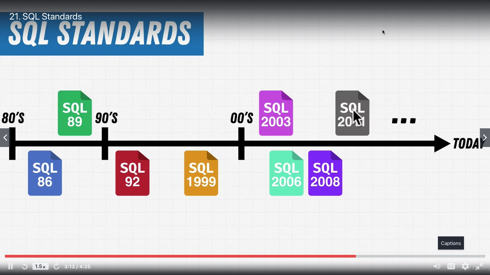
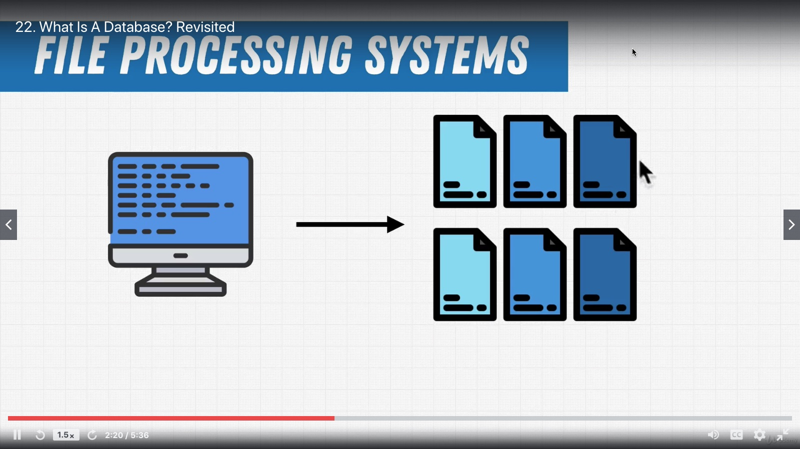
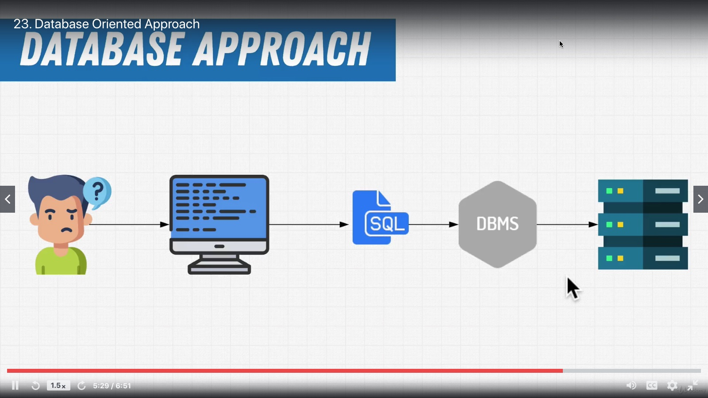
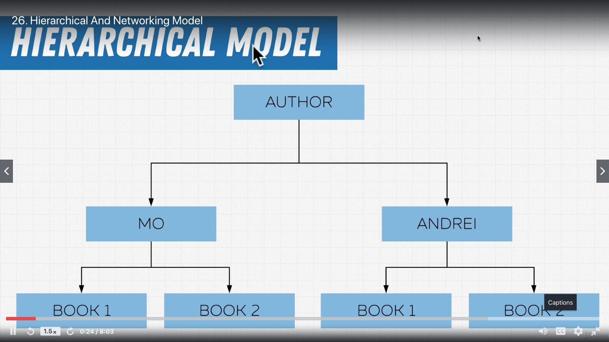
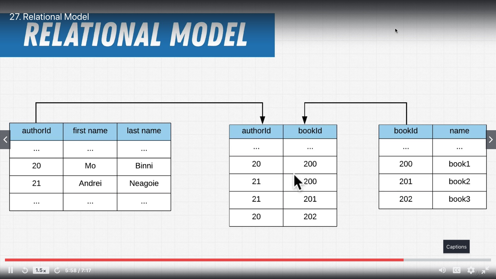
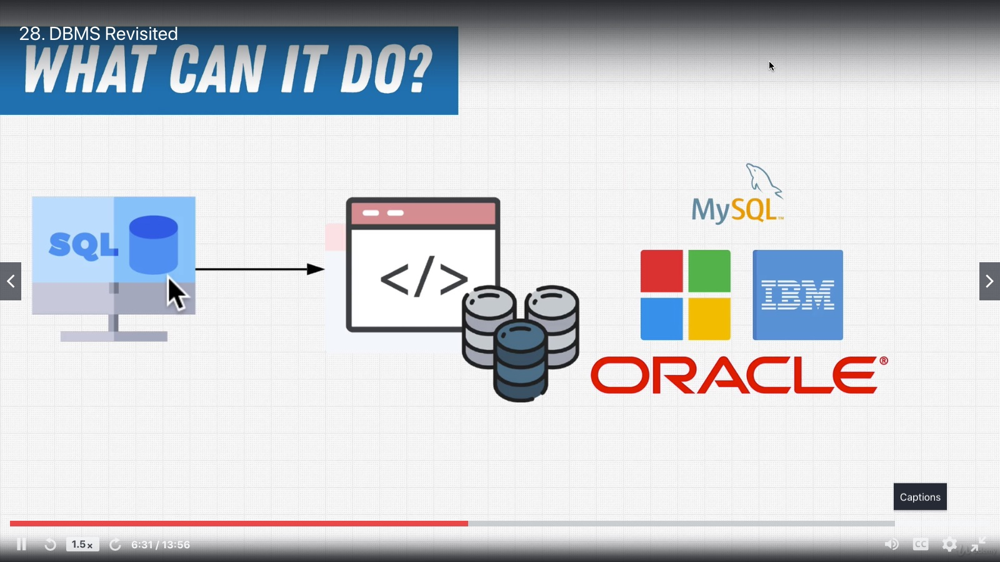
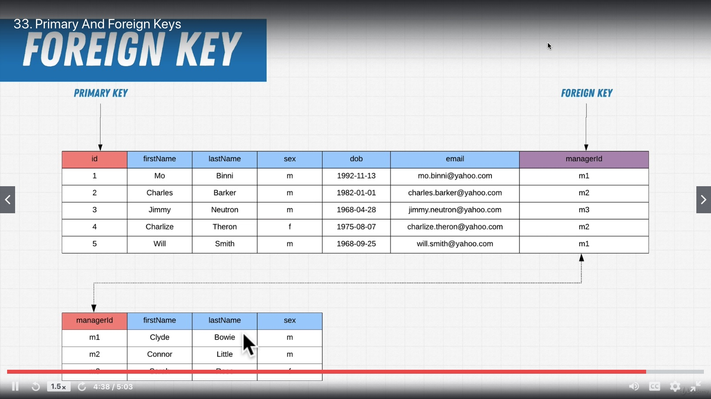
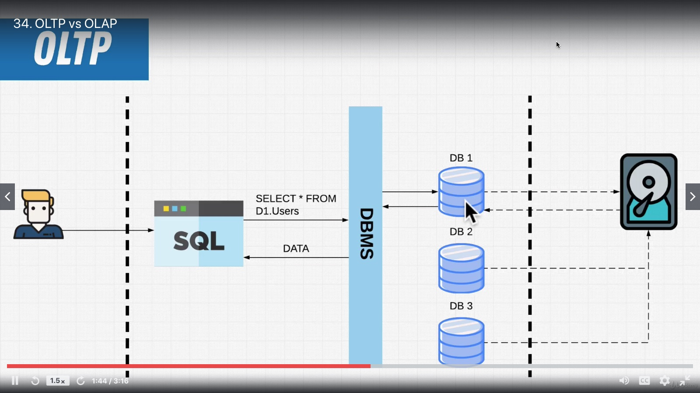

# Complete SQL + Databases Bootcamp: Zero to Mastery [2020]

## Table of Contents

- [Complete SQL + Databases Bootcamp: Zero to Mastery [2020]](#complete-sql--databases-bootcamp-zero-to-mastery-2020)
  - [Table of Contents](#table-of-contents)
    - [Section 1: Introduction](#section-1-introduction)
    - [Section 2: History And Story Of Data](#section-2-history-and-story-of-data)
    - [Section 3: Databases + SQL Fundamentals](#section-3-databases--sql-fundamentals)
    - [Section 4: Environment Setup](#section-4-environment-setup)
    - [Section 5: SQL Deep Dive](#section-5-sql-deep-dive)
    - [Section 6: Advanced SQL](#section-6-advanced-sql)
    - [Section 7: Database Management](#section-7-database-management)
    - [Section 8: Solving The Mystery](#section-8-solving-the-mystery)
    - [Section 9: Database Design](#section-9-database-design)
    - [Section 10: Database Landscape, Performance and Security](#section-10-database-landscape-performance-and-security)
    - [Section 11: Where To Go From Here?](#section-11-where-to-go-from-here)
    - [Section 12: Exrtas: Data Engineering (And the role of Machine Learning)](#section-12-exrtas-data-engineering-and-the-role-of-machine-learning)
    - [Section 13: Extras: Redis](#section-13-extras-redis)
    - [Section 14: Extra Bits: Databases In A Web App (with Node.js)](#section-14-extra-bits-databases-in-a-web-app-with-nodejs)
    - [Section 15: BONUS SECTION](#section-15-bonus-section)

### Section 1: Introduction

- [Live SQL Zoo Study Guide](https://github.com/chesterheng/sql-zoo)

**[⬆ back to top](#table-of-contents)**

### Section 2: History And Story Of Data

#### 5. What Is a Database?

It's a collection of data, a method for accessing and manipulating that data.

Data are collected by many sources

- Drone
- Mobile App
- Web App
- Videocam
- Automobile

**[⬆ back to top](#table-of-contents)**

#### 6. I Didn't Learn Anything, Try Again...

[Why is a database always represented with a cylinder?](https://stackoverflow.com/questions/2822650/why-is-a-database-always-represented-with-a-cylinder)


Data are collected and use by different people

- Product Managers: learn from data to improve the product
- Marketers: analyse business decision
- Web Developers
- Data Analysts: analyse and build machine learning model
- Data Engineer
- Data Administrator

**[⬆ back to top](#table-of-contents)**

#### 7. Database Management System (DBMS)

- How to put data in DB
- How to use/update/learn from data
- How to remove data

Confusing Acronyms

- DBMS: Database Management System
- RDBMS: Relational Database Management System
- SQL: Structured Query Language

Confusing Anagrams


**[⬆ back to top](#table-of-contents)**

#### 8. Exercise: Building Amazon

[SQL Playground](https://www.w3schools.com/sql/trysql.asp?filename=trysql_asc)

**[⬆ back to top](#table-of-contents)**

#### 9. Exercise: Building Amazon 2


**[⬆ back to top](#table-of-contents)**

#### 10. 5 Types Of Databases

5 data models

- Relational: support asset transactions
- Document: data is in a document, scalability
- Key Value: simple way to access data
- Graph: good for connected data
- Wide Columnar

**[⬆ back to top](#table-of-contents)**

#### 11. Exercise: What Is A Database?

- A database is a hardware and software system that allows a user to store, organize and use data.
- A database is a hardware and software system stores data and answer questions. 

**[⬆ back to top](#table-of-contents)**

#### 12. Section Review

- Do you have useful data?
- Install a DB to Store Data
- Use SQL to Setup + Use Data

**[⬆ back to top](#table-of-contents)**

### Section 3: Databases + SQL Fundamentals

#### 13.  SQL Playground

[DB Fiddle - SQL Database Playground](https://www.db-fiddle.com/)

**[⬆ back to top](#table-of-contents)**

#### 14. Exercise: Setting Up Your First Database

```sql
CREATE TABLE Class (
  id character(255),
  year integer NOT NULL,
  PRIMARY KEY(id)
);

CREATE TABLE Student (
  id varchar(255) NOT NULL,
  class varchar(255) NOT NULL,
  firstName varchar(255) NOT NULL,
  lastName varchar(255) NOT NULL,
  dob date NOT NULL,
  sex varchar(1) NOT NULL,
  FOREIGN KEY (class) REFERENCES Class(id),
  PRIMARY KEY (id)
);

INSERT INTO Class(id, year) VALUES('c1', 1);
INSERT INTO Class(id, year) VALUES('c2', 2);
INSERT INTO Class(id, year) VALUES('c2a', 2);

INSERT INTO Student VALUES ('s1', 'c1', 'George', 'Jacobson', '1992-01-01', 'm');
INSERT INTO Student VALUES ('s2', 'c2', 'Macy', 'Waterson', '1992-01-01', 'f');
INSERT INTO Student VALUES ('s3', 'c1', 'Bill', 'Peters', '1992-01-01', 'm');
INSERT INTO Student VALUES ('s4', 'c1', 'Janine', 'Wilson', '1992-01-01', 'f');
INSERT INTO Student VALUES ('s5', 'c2', 'Jason', 'Lipton', '1992-01-01', 'm');
```

**[⬆ back to top](#table-of-contents)**

#### 15. What Is SQL?

- SQL is programming language to talk to database
- Database is a structured set of data

**[⬆ back to top](#table-of-contents)**

#### 16. What Is A Query?

- Query is question written in SQL statement


```sql
CREATE TABLE User (
  id varchar(255) NOT NULL,
  name varchar(255) NOT NULL,
  lastName varchar(255) NOT NULL,
  dob date NOT NULL,
  sex varchar(1) NOT NULL,
  role varchar(255) NOT NULL,
  PRIMARY KEY (id)
);

INSERT INTO User VALUES ('u1', 'George', 'Jacobson', '1992-01-01', 'm', 'manager');
INSERT INTO User VALUES ('u2', 'Macy', 'Waterson', '1992-01-01', 'f', 'employee');
INSERT INTO User VALUES ('u3', 'Bill', 'Peters', '1992-01-01', 'm', 'employee');
INSERT INTO User VALUES ('u4','Janine', 'Wilson', '1992-01-01', 'f', 'manager');
INSERT INTO User VALUES ('u5', 'Jason', 'Lipton', '1992-01-01', 'm', 'manager');

SELECT * 
FROM User
WHERE role = 'employee';
```

**[⬆ back to top](#table-of-contents)**

#### 17. Imperative vs Declarative

- Declarative: What will happen?
- Imperative: How it will happen?

**[⬆ back to top](#table-of-contents)**

#### 18. History of SQL

- [Edgar F. Codd](https://www.ibm.com/ibm/history/exhibits/builders/builders_codd.html)
- [Donald Chamberlin](https://researcher.watson.ibm.com/researcher/view.php?person=us-dchamber)
- [The Story of two Genius Scientists Behind SQL](http://www.yourtechstory.com/2019/08/27/story-two-genius-scientists-sql/)
- [A Relational Model of Data for Large Shared Data Banks](section-03/codd.pdf)
- [SEQUEL: A STRUCIURED ENGLISH QUERY LANGUAGE](section-03/sequel-1974.pdf)

**[⬆ back to top](#table-of-contents)**

#### 19. Exercises: The Select Statement

[Exercises: The Select Statement](https://www.w3schools.com/sql/exercise.asp?filename=exercise_select1)

```sql
-- Insert the missing statement to get all the columns from the Customers table.
SELECT * 
FROM Customers;

-- Write a statement that will select the City column from the Customers table.
SELECT City
FROM Customers;

-- Select all the different values from the Country column in the Customers table.
SELECT DISTINCT Country 
FROM Customers;
```

**[⬆ back to top](#table-of-contents)**

#### 20. Optional: History of SQL Deep Dive

[History of Databases](https://www.youtube.com/watch?v=KG-mqHoXOXY)

**[⬆ back to top](#table-of-contents)**

#### 21. SQL Standards

[The SQL Standard – ISO/IEC 9075:2016 (ANSI X3.135)](https://blog.ansi.org/2018/10/sql-standard-iso-iec-9075-2016-ansi-x3-135/#gref)



**[⬆ back to top](#table-of-contents)**

#### 22. What Is A Database? Revisited



File processing systems

- save data on individual files
- no correlation between the files
- no relationship between the data
- update in one file is not reflected in data of relationed files
- no common standards per system
- no common models per data
- data are isolated and duplicated across systems

Model: structure of data


**[⬆ back to top](#table-of-contents)**

#### 23. Database Oriented Approach




**[⬆ back to top](#table-of-contents)**

#### 24. Exercise: SQL Starter Quiz

[SQL Starter Quiz](https://www.jetpunk.com/user-quizzes/1336712/sql-starter-quiz)

**[⬆ back to top](#table-of-contents)**

#### 25. Database Models

How you organize and store your data ?

- Hierarchical
- Networking
- Entity-Relationship
- Relational
- Object Oriented
- Flat
- Semi-Structured

**[⬆ back to top](#table-of-contents)**

#### 26. Hierarchical And Networking Model

Hierarchical Model



- each child can have only one parent
- child is tightly couple with parent
- represent 1 to many relationship


Networking Model


- represent many to many relationship


**[⬆ back to top](#table-of-contents)**

#### 27. Relational Model



**[⬆ back to top](#table-of-contents)**

#### 28. DBMS Revisited

DBMS features

- App <-> SQL <-> DBMS
- CRUD operations
- Manage your data
- Secure your data
- Transactional management




[Codd's Rules for RDBMS](https://www.w3resource.com/sql/sql-basic/codd-12-rule-relation.php)

**[⬆ back to top](#table-of-contents)**

#### 29. Relational Model Revisited


**[⬆ back to top](#table-of-contents)**

#### 30. Tables


**[⬆ back to top](#table-of-contents)**

#### 31. Columns


**[⬆ back to top](#table-of-contents)**

#### 32. Rows


**[⬆ back to top](#table-of-contents)**

#### 33. Primary And Foreign Keys



**[⬆ back to top](#table-of-contents)**

#### 34. OLTP vs OLAP

- OLTP: Support day to day



- OLAP: Support analysis


**[⬆ back to top](#table-of-contents)**

#### 35. Exercise: OLTP vs OLAP

- A database is being used to log orders and customers: OLTP
- A database is being used to figure out what new products we should offer: OLAP
- A database is being used to derive statistics for reporting to the executives: OLAP
- A database is being used to keep track of logged in users: OLTP

**[⬆ back to top](#table-of-contents)**

#### 36. Exercise: Relational Model Quiz

[Exercise: Relational Model Quiz](https://www.jetpunk.com/user-quizzes/1336712/the-relational-model)

**[⬆ back to top](#table-of-contents)**

### Section 4: Environment Setup
**[⬆ back to top](#table-of-contents)**

### Section 5: SQL Deep Dive
**[⬆ back to top](#table-of-contents)**

### Section 6: Advanced SQL
**[⬆ back to top](#table-of-contents)**

### Section 7: Database Management
**[⬆ back to top](#table-of-contents)**

### Section 8: Solving The Mystery
**[⬆ back to top](#table-of-contents)**

### Section 9: Database Design
**[⬆ back to top](#table-of-contents)**

### Section 10: Database Landscape, Performance and Security
**[⬆ back to top](#table-of-contents)**

### Section 11: Where To Go From Here?
**[⬆ back to top](#table-of-contents)**

### Section 12: Exrtas: Data Engineering (And the role of Machine Learning)
**[⬆ back to top](#table-of-contents)**

### Section 13: Extras: Redis
**[⬆ back to top](#table-of-contents)**

### Section 14: Extra Bits: Databases In A Web App (with Node.js)
**[⬆ back to top](#table-of-contents)**

### Section 15: BONUS SECTION
**[⬆ back to top](#table-of-contents)**